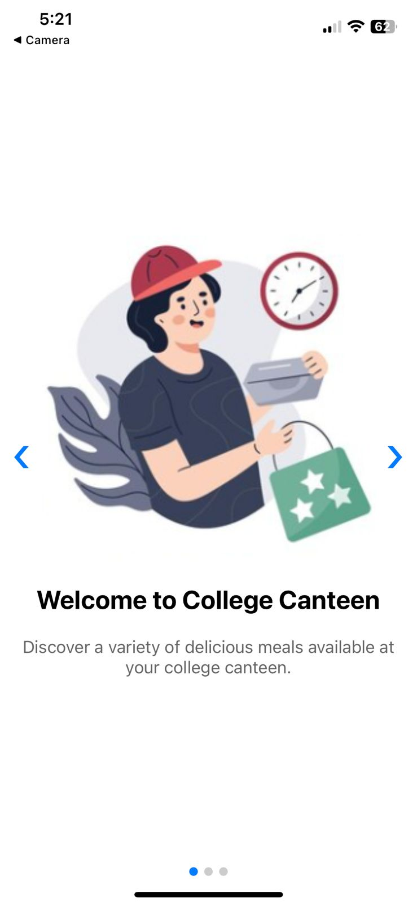
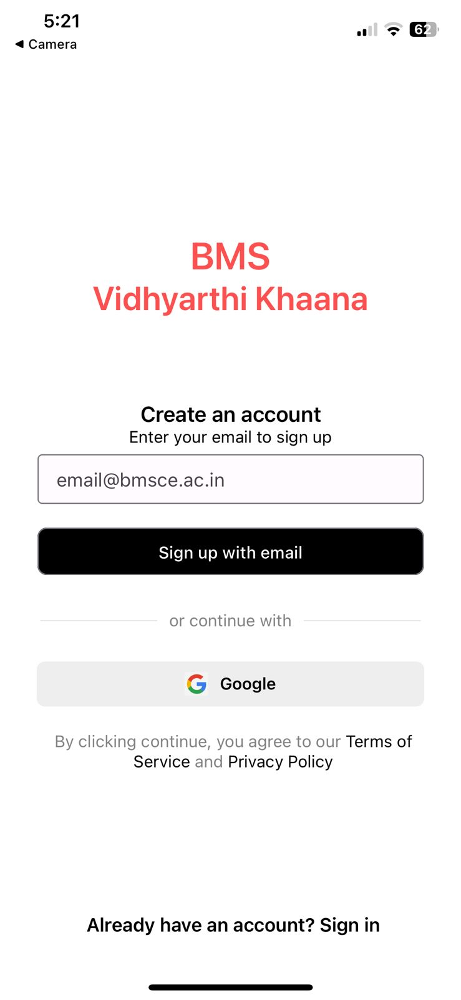
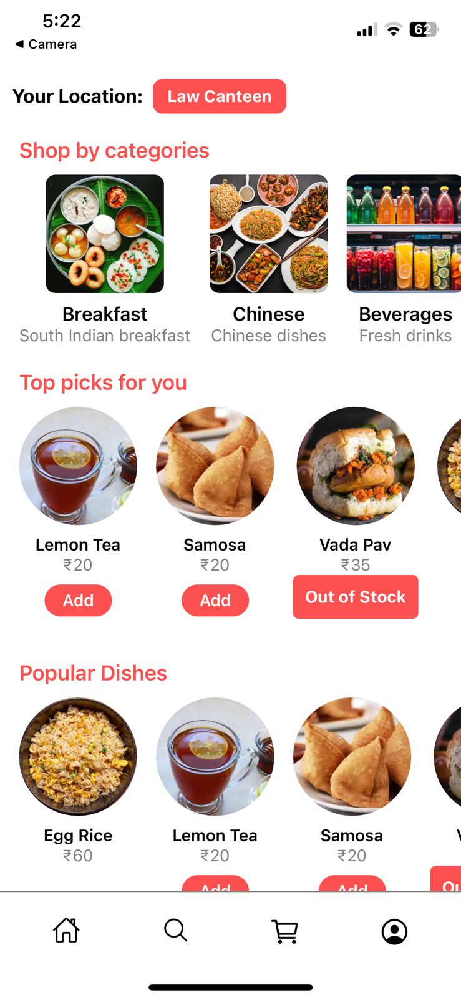
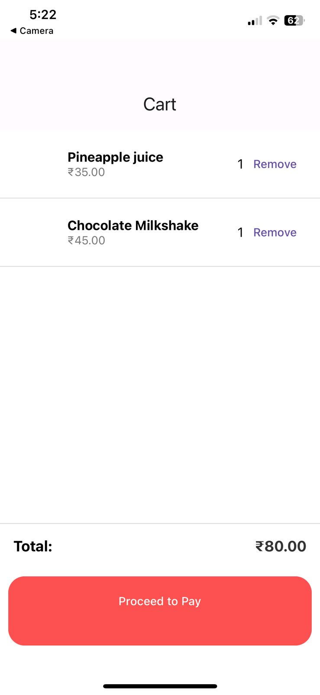
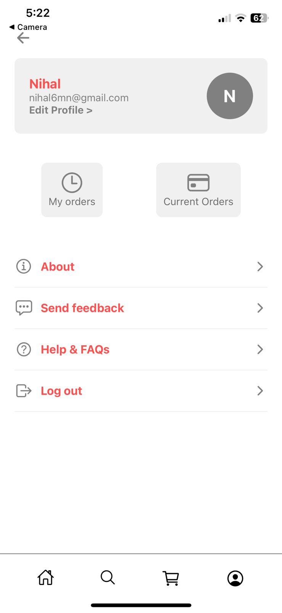

# 🍴 BMS Canteen App

A modern mobile food ordering application for the BMS college canteen.  
Built with **React Native (Expo)** and **Firebase**, it enables students and staff to browse menus, place orders, and track availability in real-time.

---


## 📸 Screenshots
### Home Screen  
 

### SignIn Screen  


### Menu Categories  
  

### Cart & Checkout  
 

### Profile Screen  
 

---

## 🛠️ Features
- 📂 **Dynamic Categories**: Breakfast, Beverages, Chinese, Short Eats, etc.  
- 🔄 **Real-time Updates**: Menu items reflect changes from Firestore (availability, price, name).  
- 🛒 **Cart Management**: Add/remove items with live quantity sync.  
- 🌟 **Top Picks & Popular Dishes**: Updated automatically from Firebase.  
- 🔑 **Google Sign-In** via Firebase Authentication.  

---

## ⚙️ Tech Stack
- **Frontend:** React Native (Expo)  
- **Backend & Database:** Firebase Firestore  
- **Authentication:** Firebase Auth (Google Sign-In)  
- **State Management:** React Hooks + Context API  
- **Styling:** React Native Stylesheets  

---

## 📊 Impact
- ⏱️ Reduced average **order wait time by 35%** with pre-ordering.  
- ❌ Minimized **out-of-stock issues by 40%** with live inventory sync.  
- 💸 Increased **canteen efficiency by 25%** through digital order management.  
- 🙌 Improved **student convenience by 50%** with contactless ordering.  

---

## 🛠️ Setup Instructions

### Prerequisites
- Node.js + npm  
- Expo CLI (`npm install -g expo-cli`)  
- Firebase Project with Firestore enabled  

### Steps
1. **Clone the repo**
   ```bash
   git clone https://github.com/your-username/bms-canteen-app.git
   cd bms-canteen-app
   ```

2. **Install dependencies**
   ```bash
   npm install
   ```

3. **Add Firebase Config**  
   Create a file `firebaseConfig.js` with your Firebase keys:
   ```js
   export const firebaseConfig = {
     apiKey: "YOUR_API_KEY",
     authDomain: "YOUR_AUTH_DOMAIN",
     projectId: "YOUR_PROJECT_ID",
     storageBucket: "YOUR_STORAGE_BUCKET",
     messagingSenderId: "YOUR_MSG_ID",
     appId: "YOUR_APP_ID",
   };
   ```

4. **Run locally**
   ```bash
   npx expo start
   ```
   Scan QR with Expo Go app.

---

## 👨‍💻 Author
**Nihal Manjunath**  
- [LinkedIn](https://www.linkedin.com/in/your-profile)  
- [GitHub](https://github.com/nihal-25)  


